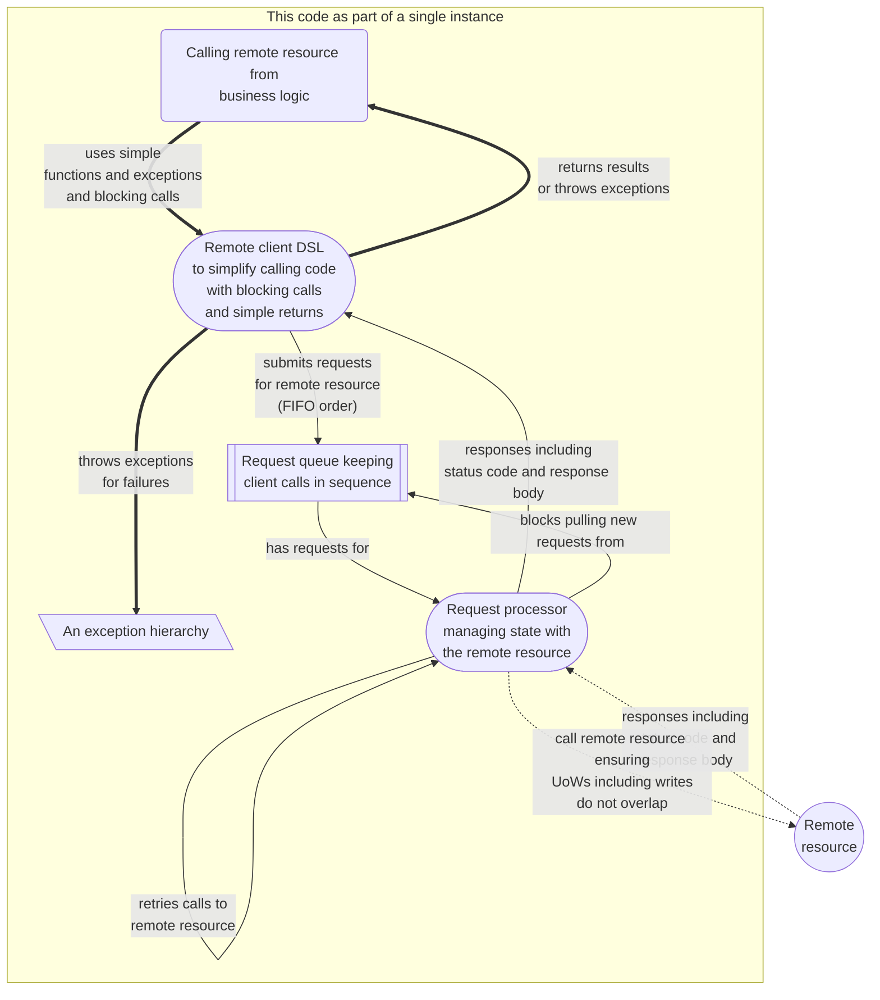

<a href="./LICENSE.md">

</a>

# Kotlin Application Transactions

[](https://github.com/binkley/kotlin-application-transactions/actions)
[](https://github.com/binkley/kotlin-application-transactions/actions/workflows/ci.yml)
[](https://github.com/binkley/kotlin-application-transactions/issues/)
[](https://github.com/binkley/kotlin-application-transactions/pulls)
[](https://snyk.io/test/github/binkley/kotlin-application-transactions)
[](http://unlicense.org/)

Experiment with application-side transactions.<br>
This project is not specific to Kotlin, and would translate well into C# or
Python given suitable abstractions.
One production project at a major company has turned this into a C#
implementation.

This is also a good project to copy as a Kotlin starter following [modern JVM
build practices](https://github.com/binkley/modern-java-practices).

This project has no production dependencies other than
[the JDK](https://docs.oracle.com/en/java/javase/17/docs/api/index.html) and
Kotlin's [stdlib](https://kotlinlang.org/api/latest/jvm/stdlib/).
Testing uses [JUnit](https://junit.org/junit5/) (test framework) and
[Kotest](https://kotest.io/) (fluent assertions).

## Build and try

To build, use `./mvnw clean verify`.
Try `./run` for a demonstration.

To build as CI would, use `./batect build`.
Try `./batect run` for a demonstration as CI would.

> **Note**
> This project assumes JDK 17.
> There are no run-time dependencies beyond the Kotlin standard library.

## Overview

### Motivation

Not all remote data sources provide transactions, yet clients wish to have
exclusive access for limited periods of time to ensure consistency across
multiple related operations.
Important is to lean on transaction support for remote systems, and fall back
to application-side transactions only to address shortcomings:
Managing transactions in your program creates challenges and corner cases.

Important problems to handle when multiple clients update a remote data source:

- Ensuring proper ordering of data changes, and avoiding interleaved updates
  that change the final state of data.
  An example:
    * Client A reads data, runs logic against that, and sends an update based
      on the logic
    * After A's read but before its write, client B writes data that would 
      change the result of client A's read
    * Ideal is that operations are in this order: Read\[A], Write\[A], Write\[B]
    * However, mistaken interleaving client requests is possible resulting in:
      Read\[A], Write\[B], Write\[A].
      This ordering gives client A wrong results
- Support for _rollback_.
  A client should be able to undo changes within their transaction without
  effecting other clients

### Goals

* Though written in Kotlin, the project may be manually translated into
  language/platforms having similar concepts (_eg_, Java, C#, Python, _et al_)
* Reads may run in parallel.
  If no write happens, then all reads are idempotent
* Writes happen in serial.
  Writes do not step on each other, and no reads happen while writing
* Units of work never interleave or overlap (units of work are collections of
  reads/writes that should have isolation from others)

### Key terms

- Read &mdash; an idempotent operation that does not modify any remote state
- Write &mdash; any operation that modifies remote state
- Unit of work &mdash; collections of remote operations that have
  "all-or-none" semantics, and do not interleave with other operations or
  units of work

### Assumptions and limitations

This project demonstrates one approach to application-side transactions.
**You are nearly always better off using transaction features provided by your
remote service.**

Terms used include:

- _Clients_ &mdash; treated as separate local threads: in a true distributed
  scenario these would be multiple processes
- _Remote resource_ &mdash; treated as an independent "source of truth": in a
  true distributed scenario this would be a remote service.
  The same concerns crop up for local, exclusive resources
- Exception hierarchy &mdash; for languages/platforms with exceptions, clients
  handle application-specific exceptions rather a generic "it failed"
  exceptions, and should recognize failures related to transactions
- This project _does not_ address distributed transactions; it assumes a
  _single_ remote data source service either local or remote

### Minimally assumed code library support

- A searchable, concurrent-safe queue for submitting requests for remote
  processing
- The queue can block when looking for next element (alternative: add 
  busy-retry) and when searching for a middle matching element
- A means for exclusive access to the remote resource
- Callers and tests can wait on completion of submitted work
- Thread management such that writers can wait for readers to complete

## Design

Here "caller" means those offering requests to a shared queue, and "processor"
means a single consumer of the queue processing requests.

The implementation is a simple state machine based on the type of request:

- Simple reads run in parallel
- Writes run in units of work, and are always serial and exclusive of other 
  remote calls
- Units of work (transactions) also wait for reads to finish, and then all
  remote requests in the unit of work run in serial [^1].
  Units of work are exclusive and never overlap:
  this ensures you can batch several remote calls together that need isolation
  
It looks like:



[^1]: There is a slight optimization that the first reads of a unit of work can
run in parallel with existing simple reads until a write request is encountered

### Caller API

At a top level use
[RequestClient](src/main/kotlin/hm/binkley/labs/applicationTransactions/client/RequestClient.kt).
An example session might be:

```kotlin
val client = RequestClient(requestQueue) // Queue is shared with processor

val data = client.readOne("A REMOTE READ") // runs in parallel
val otherData = client.readOne("A DIFFERENT READ") // runs in parallel

try {
    println(client.readOne("ABCD PQRSTUV")) // Bad syntax
} catch (e: IllegalStateException) {
    // Log or respond to caller
}

client.inExclusiveAccess(2 /* expected max calls */).use { uow ->
    val status = uow.readOne("CHECK SOMETHING")
    if ("OK" != status) {
        // Example of early return from transaction
        uow.cancelAndKeepChanges()
        return
    }
    
    val result = uow.writeOne("CHANGE SOMETHING")
    if (result is FailRemoteResult) {
        // Example of manual rollback
        uow.cancelAndUndoChanges("SOME UNDO INSTRUCTION")
    }
    
    // Unit work is automatically "closed" after 2 remote calls because of the
    // "inExclusiveAccess" argument of 2
}
```

### Processor API

Start processing requests by running the processor on an independent thread:

```kotlin
threadPool.submit(
    RequestProcessor(requestQueue, threadPool, remoteResourceManager)
)
```

where specific to your language `requestQueue` is a thread-safe, blocking FIFO 
queue that is searchable, `threadPool` is a facility for starting and managing 
threads, and `remoteResource` represents calling the remote resource you 
would like to protect against simultaneous writes or blocks work.

### Bonus

The
[SearchableBlockingQueue](./src/main/kotlin/hm/binkley/labs/util/SearchableBlockingQueue.kt)
supports searching within a blocking queue on the JVM.
It is generic and independent of this project.
Similar concepts are suitable for non-JVM platforms such as C#.

### Tips

The request processor should send results to the blocking client call before 
submitting asynchronous logging.
Tests (and caller) can then rely on that operations are complete&mdash;success 
or failure&mdash;before logging happens.

## Configuration

There are only three knobs for tweaking behavior:

- `maxWaitForWorkUnitsInSeconds` passed when constructing `RequestProcessor`
  (default 1s).
  How long the processor waits for the next unit in a unit of work before 
  timing out and canceling the unit of work
- `maxWaitForRemoteResourceInSeconds` passed when constructing 
  `RequestProcessor` (default 30s).
  How long the processor waits in a unit of work for executing reads to finish 
  before executing a write
- `waitBeforeRetryRemoteInSeconds` passed when constructing 
  `RemoteResourceManager` (default 1s).
  How long to wait before retrying the remote resource if it was busy the 
  first attempt.
  The current code only retries 1 time

Another configuration is how you set up your thread pool.
That is outside the scope of this project, but can be important to make best 
use of threads.
